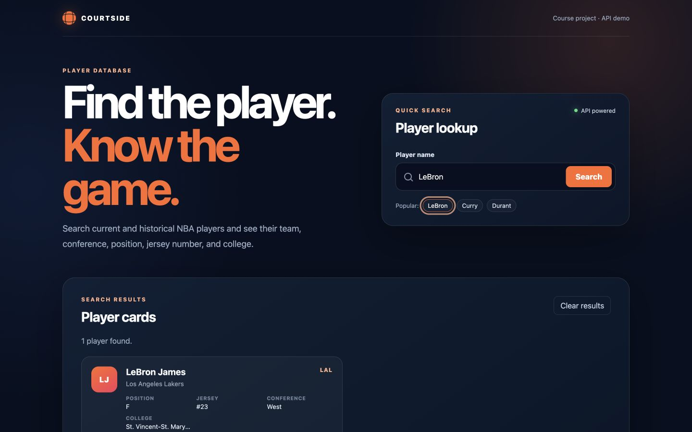

# NBA Player Search

A browser-based course project that searches for NBA players by first or last name and displays player and team information from the balldontlie API.



## Why this project is in my portfolio

This is my strongest completed coding project from the reviewed course files. It demonstrates HTML, responsive CSS, JavaScript, DOM manipulation, asynchronous API requests, and user-facing error handling.

## My contribution

This was a three-person academic team project. I completed the frontend implementation: the HTML structure, CSS presentation, JavaScript behavior, REST API request, results table, validation, reset behavior, and error states.

## Features

- Search by a player's first or last name.
- Fetch player information with `fetch` and `async/await`.
- Display name, team, conference, position, jersey number, and college.
- Handle missing configuration, no results, and API failures.
- Clear the current query and results.
- Support smaller screens with a responsive layout and horizontally scrollable results.

## Technologies

- HTML5
- CSS3
- JavaScript
- Fetch API
- balldontlie REST API
- Playwright browser smoke tests

## Setup

1. Clone or download this repository.
2. Create a balldontlie API key from the provider's developer website.
3. Copy `config.example.js` to `config.js`.
4. Replace `YOUR_API_KEY_HERE` in `config.js` with your own key.
5. Start a local server from the project folder. One simple option is:

   ```bash
   python3 -m http.server 8000
   ```

6. Open <http://localhost:8000> in a browser.

`config.js` is ignored by Git so the key is not committed.

## Usage

Enter a player's first or last name, select **Search**, and review the returned table. Select **Clear** to reset the page.

## Tests

Install the development dependency and run the browser smoke tests:

```bash
npm install
npx playwright install chromium
npm test
```

The prepared version was verified on September 8, 2026 with mocked API responses for:

- Successful search and table rendering.
- Empty results.
- API failure handling.

## Security note

The original course file contained an API key in client-side JavaScript. That key was removed from this public-ready version and should be revoked. A frontend-only website cannot keep an API key secret from someone using the browser; a real public deployment should send the request through a backend or serverless function that stores the key as an environment secret.

## Known limitations

- A valid balldontlie API key is required.
- There is no backend, database, authentication, pagination control, or caching.
- The browser sends the configured key with the API request, so this version is intended for local demonstration rather than secure public deployment.
- Tests mock the external API and do not prove that a real API key or the provider's live service is working.
